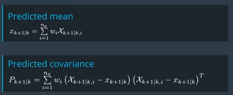
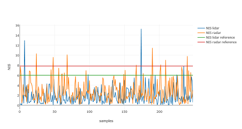

# Term2 - Project 2: Unscented Kalman Filter
### Ajay Paidi

# Objective
The objective of this project is to implement an Unscented Kalman Filter that could fuse sensor data from both radar and lidar data and perform object tracking.

# File structure
- **ReadMe.md**: This file
- **main.cpp**: The main executable program that loops through the input file measurements and calls the unscented kalman filter (ukf) to get prediction outputs. This file is provided by Udacity and used as is.
- **ukf.h** and **ukf.cpp**: Contains the implementation of the unscented kalman filter. It contains the implementation of both the prediction and measurment update steps.
- **tools.h** and **tools.cpp**: Utility class to compute RMSE.

# Description

## Unscented Kalman Filter
The Unscented Kalman Filter (UKF) is used to estimate states that involves non-linear prediction (aka process) or measurement models. While the EKF (Extended Kalman filter) has the capability to deal with non-linear models, the UKF has been found to produce better results. This is because the EKF only tries to linearly approximate a non-linear model while the UKF tries to address this non-linearity using a more sophisticated approach using 'sigma points'.

# Implementation
The UKF computes an estimate using the same steps as a Kalman filter - prediction step and measurement update step. However the details of the implementation vary considerably owing to the non-linear process and measurement models. Here is the general roadmap of the individual implementation steps

## Prediction step
The implemented UKF uses a CTRV (Constant Turn Rate and Velocity) model to depict the state of the object to be tracked. This state model can be codified as follows
x = [px py v $ psi $ \psi]

The transformation that transforms the above state vector from time step k to time step k+1 is no longer a linear transformation. The UKF addresses this by  
applying the 'unscented transformation' (non-linear) to some chosen points called sigma points on each dimension of the state vector.

### Generate sigma points
The implementation for this step can be found in `AugmentedSigmaPoints` function in ukf.cpp.
The idea here is that 2 points are chosen for each state in the state vector. In addition one point is chosen to represent the mean state. Further, the state vector is augmented to capture in the process noise. So the augmented state vector has 7 dimensions leading to 2*7 + 1 = 15 sigma points. While choosing the sigma points, a 'spreading parameter' lambda is used to appropriately spread the two sigma points for each dimension around the vectors of the state covariance matrix. The lambda is typically chosen to be 3 - n_aug where n_aug is the dimension of the augmented state vector.   

### Predict sigma points
The implementation for this step can be found in `Prediction` function in ukf.cpp.
The process model is applied to each of the sigma points. The process model is basically a set of equations that can be obtained by integrating the differentiated state model over a desired time interval \delta * t.

Note that the final process model implemented in the ukf.cpp takes into account the process noise as well (which are captured in the 6th and 7th dimension of each of the augmented sigma points). The predicted sigma points will have a state dimension of 5 for each point (after applying the necessary process noise correction).

### Predict mean and covariance
The implementation for this can be found in `PredictMeanAndCovariance` function in ukf.cpp.
This step is fairly straight forward and involves implementing a set of equations to compute the mean and covariance of the predicted sigma points.

The weights used to compute the above equations is as follows

In this case the lambda acts as a 'de-spreading' parameter. The reasoning here is that the sigma points were originally generated by spreading the sampled points around the covariance ellipse. Now inorder to capture the covariance matrix (given the sigma points) the lambda is chosen to de-spread (or compress) the sigma points onto the covariance ellipse.

## Measurment update step
The predicted state mean and state covariance at the end of the previous prediction step is then updated with measurement (radar or lidar) information.

### Predict radar/lidar measurement
The implementation for this can be found in `PredictLidarMeasurement` and `PredictRadarMeasurement` functions in ukf.cpp.
This step involves transforming the predicted mean and covariance from state space into the measurement space. This is done by transforming the predicted sigma points from the previous step into the measurement space. Note that this transformation would be non-linear for radar (cartesian to polar) and linear for lidar. The computation of the predicted mean and covariance is now done in the measurement space using the equations similar to the previous (with the inclusion of the additive measurement noise).

### Update
The implementation for this can be found in `Update` function in ukf.cpp.
This does the actual update of the predicted state mean and state covariance using the actual measurement and the predicted mean and covariance from the previous step. This is very similar to the update step in a simple Kalman filter. The only difference is the way in which the Kalman gain is computed. The update equations are shown below

## Choice of process noise params
One important aspect of the implementation is to choose the right values for the process noise params. The linear acceleration noise was set to a value of 0.8 m/s^2. This was chosen assuming a bicycle that can go from 0 to 22 mph in 12 seconds yielding a top acceleration of 0.8 m/s^2. Similarly the yaw acceleration noise was set to a value of 1.0 rad/s^2 assuming the bicylist can approximately complete 1/6th of a circle every second (2*pi/6 => pi/3 => 1.0 rad/s^2).
Inorder to make sure that the noise params are appropriately chosen, one can plot the NIS (Normalized Innovation Squared) values. The NIS is a scalar metric that captures the error (difference between measured and predicted values) in relation to the covariance matrix. Below is the chart of the NIS values for the implemented UKF on the Udacity provided data. The idea here is that less than 5% of the NIS values should exceed the baseline.

# Results
The extended Kalman filter (EKF)  was tested on the dataset provided by Udacity and evaluation metric used was RMSE (Root Mean Squared Error) between the predicted states and the provided ground truth values.
The RMSE for the dataset was [0.06, 0.08, 0.33, 0.21] and the visualization is shown below

# References
- Starter code provided by Udacity / Mercedes Benz https://github.com/udacity/CarND-Unscented-Kalman-Filter-Project.
- Udacity lecture videos / notes.
